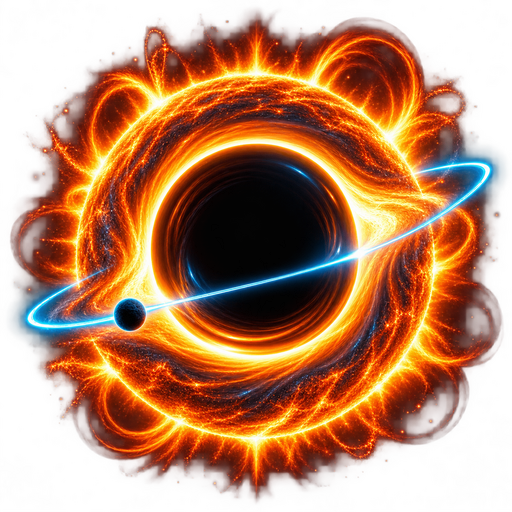

  
  <h1>Helios Ascendant Project</h1>
  
<strong>A cinematic, real-time 3D exploration of the Solar System and deep space.</strong>

  

    <a href="https://argyrios-dev.github.io/Helios-Ascendant-Project/">Launch the live experience</a>
  

Overview

Helios Ascendant is an interactive WebGL astronomy simulator built for the browser with React, Three.js, and React Three Fiber. It combines Keplerian orbital motion, real-time scientific telemetry, procedural planetary materials, cinematic post-processing, and smooth target-following camera controls in a GPU-focused rendering architecture.

The experience contains 19 selectable objects: the Sun, all eight planets, five dwarf planets, two supermassive black holes, and three space observatories.

Highlights

Keplerian orbits driven by approximate real orbital elements referenced to J2000

Simulation initialized from the current UTC time

Exact pause, 1×, 10×, and 100× time multipliers, independent of frame rate

Live distance, orbital velocity, epoch, eccentricity, and semimajor-axis telemetry

Procedural high-detail surfaces generated directly in GLSL

Earth atmosphere rendered with a Fresnel limb-glow shader

Real-time solar illumination, soft shadows, ACES filmic tone mapping, bloom, and vignette

Smooth cinematic camera tracking for moving targets

Dedicated visualizations for Sagittarius A* and M87*

Custom 3D models for Hubble, James Webb, and Euclid

Local 4K deep-space background with no runtime dependency on external asset servers

WebGL 2 capability detection, render error recovery, and an on-screen FPS monitor

Automatic GitHub Pages deployment through GitHub Actions

Celestial Catalog

Category

Objects

Solar System

Sun, Mercury, Venus, Earth, Mars, Jupiter, Saturn, Uranus, Neptune

Dwarf planets

Ceres, Pluto, Haumea, Makemake, Eris

Deep space

Sagittarius A*, M87*

Observatories

Hubble Space Telescope, James Webb Space Telescope, Euclid

Controls

Input

Action

Drag

Orbit around the selected object

Mouse wheel or trackpad

Zoom in and out

Object list

Select and follow a celestial body or observatory

Pause / 1× / 10× / 100×

Change the simulation time scale

Technology

Vite 8

React 19

Three.js

React Three Fiber

React Three Drei

React Three Postprocessing

Zustand

GitHub Actions and GitHub Pages

Performance Architecture

Orbital positions, axial rotation, camera tracking, shader animation, and telemetry scheduling are updated outside React's render cycle. Mutable scene objects are updated directly through references inside useFrame, keeping React state focused on user interface data.

The renderer uses a capped device-pixel ratio, disabled MSAA, selective luminance bloom, no normal post-processing pass, reusable geometries, and explicit GPU resource disposal. Simulation deltas are clamped to prevent large jumps after a suspended or backgrounded browser tab.

Run Locally

Requirements

Node.js 20.19 or newer

npm

A browser with WebGL 2 and hardware acceleration enabled

git clone https://github.com/argyrios-dev/Helios-Ascendant-Project.git
cd Helios-Ascendant-Project
npm ci
npm run dev

Vite will print the local development URL in the terminal.

Production Build

npm run build
npm run preview

The optimized static site is generated in dist/.

GitHub Pages Deployment

The repository includes .github/workflows/deploy.yml. Every push to main installs the locked dependencies, creates a production build, uploads the static artifact, and deploys it to GitHub Pages.

In the repository settings, select Settings → Pages → Source → GitHub Actions. After that, deployment is automatic.

A manual gh-pages deployment script is also available:

npm run deploy

Scientific Scope

Orbital positions are calculated from fixed, approximate Keplerian elements and are suitable for interactive visualization and education. Planetary radii and orbital distances use separate adaptive visual scales so the entire system remains navigable. This project is not a replacement for mission-grade ephemerides, relativistic propagation, or JPL Horizons data.

Asset Policy

The production experience does not fetch textures, models, or imagery from third-party servers at runtime. Planetary appearance is generated procedurally, while the deep-space background and application icons are stored locally in the repository.

  <strong>HELIOS ASCENDANT</strong> 
  Built for high-performance exploration beyond the horizon.

